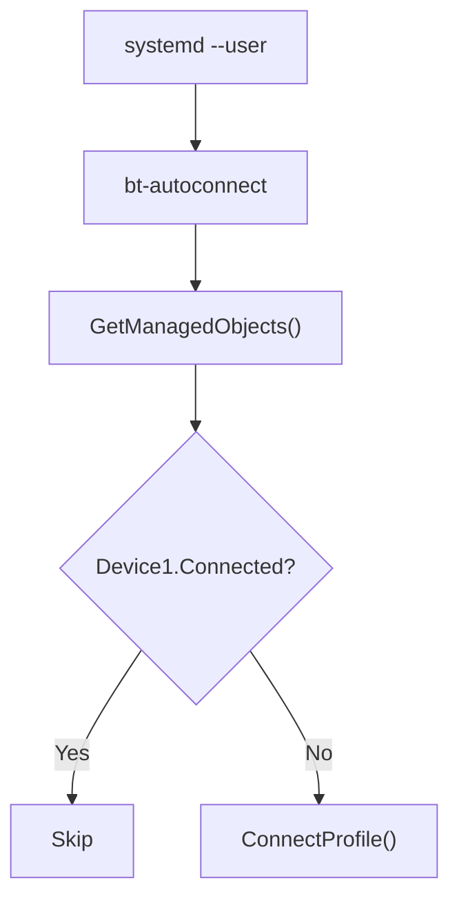

# Bluetooth Auto Connect
## Overview

A lightweight user daemon that automatically reconnects configured Bluetooth services using BlueZ D-Bus API.
This exists because BlueZ trusted devices do not automatically reconnect after system startup.

Blueman solves this problem through its AutoConnect plugin. This implementation provides similar functionality without requiring Blueman (Bluetooth Manager).

## Motivation

On Arch Linux, my Bluetooth headset does not reconnect automatically after login/suspend/sleep, even the device state is:

```text
Paired    = true
Trusted   = true
Connected = false
````

I assumed `Trusted` meant BlueZ would reconnect the device automatically. After tracing the behavior, it turned out that this assumption was incorrect.
BlueZ only stores device state and permissions. It does not initiate reconnection by itself.

## Existing Solution

Blueman already solves this problem through its AutoConnect plugin.
Instead of keeping the entire Blueman applet running, I wanted a minimal implementation that only performs the auto-connect logic.
The goal is to reproduce Blueman's behavior using only the BlueZ D-Bus API.

## How Blueman Works

After reading Blueman's source code, the auto-connect plugin is surprisingly simple.

Every configured interval:
1. iterate configured devices
2. check `Device1.Connected`
3. if disconnected, call `ConnectProfile()`

There is no special handling for:
* trusted devices
* boot events
* manual disconnect
* Bluetooth power events

The daemon simply retries periodically.
This implementation intentionally follows the same design.

## Files

```text
home/
├── .local/
│   └── bin/
│       └── bt-autoconnect
└── .config/
    └── systemd/
        └── user/
            └── bt-autoconnect.service
```

`bt-autoconnect`
* python-based binary
* loads configuration
* resolves BlueZ object paths
* checks connection state
* connects configured profiles

`bt-autoconnect.service`
Starts the daemon automatically in the user session.

## Connection Flow



## Why ConnectProfile()

Audio headsets usually expose multiple Bluetooth profiles.
Instead of calling the generic `Connect()` method, the daemon connects the required profile explicitly.

Example:
```text
0000110b-0000-1000-8000-00805f9b34fb
```
Audio Sink (A2DP)

## Design Decisions

This code intentionally:
* does not depend on Blueman
* does not execute `bluetoothctl`
* communicates directly with BlueZ through D-Bus
* follows Blueman's polling approach instead of implementing custom reconnect logic
